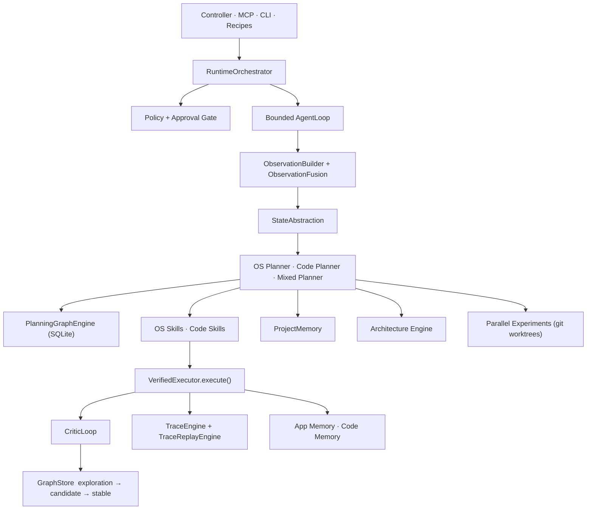

<div align="center">

# OracleOS

**A safe, local macOS agent runtime — one execution core, two agents, zero compromises.**

[](https://swift.org)
[](https://developer.apple.com/macos/)
[](docs/README.md)
[](LICENSE)
[](#-quick-start)

[Quick Start](#-quick-start) · [Architecture](#-architecture) · [MCP Tools](#-mcp-tools) · [Safety](#-safety-model) · [Docs](docs/README.md) · [Contributing](CONTRIBUTING.md)

</div>

---

OracleOS runs **two agents on a single execution core** — one controls your Mac, the other writes your code. They share a unified trust boundary, a policy engine, a verified execution path, and a single SQLite-backed graph. No duplicated state. No split trust surfaces.

```
macOS Operator Agent  ──┐
                        ├──▶  RuntimeOrchestrator  ──▶  VerifiedExecutor  ──▶  Trace + Graph
Software Engineer Agent ──┘        │
                               Policy Gate
```

---

## ✦ Quick Start

> **Requirements:** macOS 14+, Swift 6.0+, Accessibility and Screen Recording permissions.

```bash
git clone https://github.com/dawsonblock/ORC1.git
cd ORC1
swift build

# First-time setup
./.build/debug/oracle setup
./.build/debug/oracle doctor
```

To open the native controller UI:

```bash
open OracleController.xcworkspace    # in Xcode
# or build a packaged app:
./scripts/build-controller-app.sh --configuration release
```

---

## ✦ What It Does

### macOS Operator Agent

Interact with any macOS app through a safe, verified action path — no terminal/shell UI control, no arbitrary script execution.

- **AX-first perception** — inspect live UI trees, capture screenshots, and read element context
- **Verified interactions** — click, type, press, scroll, focus, and window-manage with pre/post observation checks
- **Replayable recipes** — save and replay multi-step workflows as portable JSON
- **Policy gating** — risky actions (send, purchase, destructive ops) require explicit approval before execution

### Software Engineer Agent

Code, build, test, and commit — scoped to your workspace, no unsafe shell automation.

- **Repository intelligence** — index structure, symbols, dependencies, and test suites
- **Workspace-scoped runner** — file edits, builds, tests, and safe git ops only
- **Bounded experiments** — fan out candidate fixes across isolated git worktrees, rank by test passage and diff quality
- **Project memory** — canonical engineering memory (not chat memory) covering decisions, open problems, rejected approaches, and known-good patterns

### Shared Substrate

Both agents share **one** of everything: runtime orchestrator, policy engine, verified executor, trace system, SQLite graph store, and memory layer.

---

## ✦ Architecture



### Execution Spine

Every effect flows through a single, auditable path:

```
Intent
  → RuntimeOrchestrator.submitIntent
  → Planner
  → Command
  → VerifiedExecutor        ← the trust boundary
  → CommandRouter
  → DomainRouter
  → Execution
  → Events
  → CommitCoordinator
```

And every action follows the same loop:

```
Observe → Abstract → Plan → Gate → Execute → Trace → Learn
```

> **Note:** The experiment subsystem (`oracle_experiment_search`) is a privileged side path that bypasses this spine by design. Experiment candidates run in isolated git worktrees evaluated by `ParallelRunner`, not through `RuntimeOrchestrator` or `VerifiedExecutor`. No experiment result is automatically replayed through the main execution path.

Ambiguous states fail closed. The system is deliberately slow to overclaim.

### Core Layers

| Layer | What it does |
|---|---|
| **Observation** | `ObservationBuilder` + `ObservationFusion` produce canonical, stable snapshots |
| **Planning State** | `StateAbstraction` collapses observations into reusable nodes — prevents state cardinality explosion |
| **Verified Execution** | `VerifiedExecutor.execute(_:)` enforces policy, routes, verifies postconditions, and emits auditable events |
| **Graph Learning** | SQLite-backed tiered knowledge: `exploration → candidate → stable`. Only replayed, trusted outcomes reach `stable` |
| **MCP Boundary** | Strictly typed `MCPToolRequest` / `MCPToolResponse` / `JSONValue` — no `[String: Any]` at the boundary |

For full details see [ARCHITECTURE.md](ARCHITECTURE.md).

---

## ✦ MCP Tools

OracleOS exposes **30 stable public tools** under `oracle_*` names via the [Model Context Protocol](https://spec.modelcontextprotocol.io/).

| Category | Tools |
|---|---|
| **Perception** | `oracle_context` `oracle_state` `oracle_find` `oracle_read` `oracle_inspect` `oracle_element_at` `oracle_screenshot` |
| **Actions** | `oracle_click` `oracle_type` `oracle_press` `oracle_hotkey` `oracle_scroll` `oracle_focus` `oracle_window` |
| **Vision** | `oracle_ground` `oracle_parse_screen` |
| **Diagnostics** | `oracle_wait` `oracle_permissions` `oracle_doctor` |
| **Recipes** | `oracle_recipes` `oracle_run` `oracle_recipe_show` `oracle_recipe_save` `oracle_recipe_delete` |
| **Knowledge** | `oracle_memory_query` `oracle_memory_draft` |
| **Experiments** | `oracle_experiment_search` |
| **Architecture** | `oracle_architecture_review` `oracle_candidate_review` |
| **Workflows** | `oracle_workflow_mine` `oracle_workflow_list` `oracle_workflow_execute` |

All tools are versioned at the wire boundary. Unknown versions are rejected immediately — no fallback guessing.

---

## ✦ Safety Model

OracleOS is intentionally conservative. When policy state is ambiguous, execution fails closed.

| | Examples |
|---|---|
| ✅ **Always allowed** | Observation, inspection, safe navigation, workspace reads, local build / test / lint, safe git (`status` `diff` `branch` `commit`) |
| 🔐 **Approval-gated** | Send / submit flows, purchase interactions, destructive file ops, `git push`, sensitive config changes |
| 🚫 **Hard blocked** | Terminal / shell UI control, arbitrary shell strings, writes outside workspace, force push, system file mutation |

### Governance Invariants

- One execution truth path — no silent shortcuts
- Reusable knowledge is strictly separated from episode residue
- Recovery is a first-class planning mode, not error handling
- Architecture growth is gated by eval coverage
- Experiment evidence cannot promote directly to `stable` knowledge

See [docs/GOVERNANCE.md](docs/GOVERNANCE.md) for the full normative contract.

---

## ✦ Oracle Controller

A native macOS app for supervised operation — policy approvals, trace inspection, recipe execution, experiment metadata, and project-memory browsing in one place. First launch walks you through Accessibility, Screen Recording, and optional vision sidecar setup.

```bash
# Run from source
swift build && open OracleController.xcworkspace

# Build a packaged release
./scripts/build-controller-app.sh --configuration release
./scripts/create-controller-dmg.sh --configuration release
```

Details: [docs/oracle-controller.md](docs/oracle-controller.md)

---

## ✦ Repository Layout

```
Sources/
  OracleOS/               runtime, planning, MCP tools, memory, execution core
  OracleController/       native controller UI
  OracleControllerHost/   bundled host process
  OracleControllerShared/ shared models and protocols
  oracle/                 CLI entrypoints (setup, doctor, status)
Tests/                    unit tests, runtime tests, evals, fixtures
AppResources/             controller assets, entitlements, release notes
docs/                     governance, architecture, and status docs
ProjectMemory/            canonical engineering memory (ADRs, risks, roadmap)
recipes/                  replayable JSON workflow recipes
scripts/                  build, packaging, notarization helpers
vision-sidecar/           optional Python vision service (ScreenCaptureKit fusion)
web/                      Vite + Tailwind frontend assets
```

---

## ✦ Development

```bash
swift build                              # compile everything
swift test                               # run all tests

# CLI
./.build/debug/oracle setup             # first-time setup wizard
./.build/debug/oracle doctor            # system health check
./.build/debug/oracle status            # runtime status
./.build/debug/oracle version           # version info

# Controller (unsigned debug build)
./scripts/build-controller-app.sh --configuration debug --skip-sign
./scripts/create-controller-dmg.sh --configuration debug --skip-sign
```

---

## ✦ Roadmap

OracleOS is on the path from **safe local operator + bounded coding agent** toward a **project-carrying engineering runtime**.

| | Area |
|:---:|---|
| ✅ | Verified execution with pre/post observation checks |
| ✅ | Planning-state abstraction over raw observations |
| ✅ | SQLite-backed graph learning with trust tiers |
| ✅ | Bounded, graph-aware agent loop |
| ✅ | Native controller with guided onboarding |
| ✅ | Project memory, parallel experiments, architecture engine |
| ✅ | Strictly typed MCP boundary (`JSONValue` / `MCPToolRequest`) |
| 🔄 | Vision as dominant fused perception path |
| 🔄 | Project-memory promotion workflows |
| 🔄 | Architecture governance beyond advisory |
| 🔜 | Long-horizon project execution with eval-backed gating |
| 🔜 | Workflow synthesis and promotion from traces |
| 🔜 | Belief-state reasoning and learned policies |

---

## ✦ Contributing

The easiest way to contribute is by submitting **recipes** — portable JSON workflows that automate real macOS tasks. See [CONTRIBUTING.md](CONTRIBUTING.md) for guidelines and the governance contract at [docs/GOVERNANCE.md](docs/GOVERNANCE.md).

---

## ✦ License

[MIT](LICENSE) © 2026 Oraclewright
